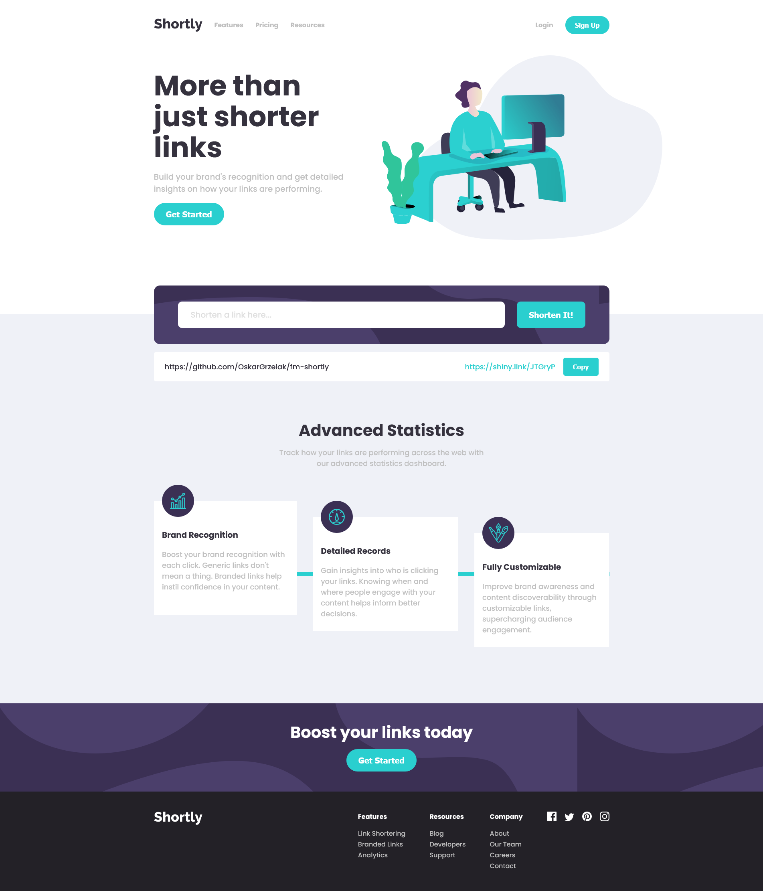

# Frontend Mentor - Shortly URL shortening API Challenge solution

This is my solution to the [Shortly URL shortening API Challenge challenge on Frontend Mentor](https://www.frontendmentor.io/challenges/url-shortening-api-landing-page-2ce3ob-G).

## Table of contents

- [Overview](#overview)
  - [The challenge](#the-challenge)
  - [Screenshot](#screenshot)
  - [Links](#links)
- [My process](#my-process)
  - [Built with](#built-with)
  - [What I learned](#what-i-learned)
- [Author](#author)

## Overview

### The challenge

Users are be able to:

- View the optimal layout for the site depending on their device's screen size
- Shorten any valid URL
- See a list of their shortened links, even after refreshing the browser
- Copy the shortened link to their clipboard in a single click
- Receive an error message when the `form` is submitted if:
  - The `input` field is empty

### Screenshot

### Links

- Solution URL: [https://www.frontendmentor.io/solutions/responsive-shortly-app-using-reactjs-and-styled-components-SqkYdY2sZ](https://www.frontendmentor.io/solutions/responsive-shortly-app-using-reactjs-and-styled-components-SqkYdY2sZ)
- GitHub Repository URL: [https://github.com/OskarGrzelak/fm-shortly](https://github.com/OskarGrzelak/fm-shortly)
- Live Site URL: [https://oskargrzelak.github.io/fm-shortly/](https://oskargrzelak.github.io/fm-shortly/)

## My process

### Built with

- [React](https://reactjs.org/)
- [Styled Components](https://styled-components.com/)
- [ShrtCode API](https://shrtco.de/)

### What I learned

The challenge has been a great opportunity to train my React skills, especially these related to creating custom hooks, using context API, and communicating with external APIs. Moreover, it has been a convenient chance for me to start working with the Styled Components library.

## Author

- Website - [Oskar Grzelak](http://www.oskargrzelak.pl)
- Frontend Mentor - [@OskarGrzelak](https://www.frontendmentor.io/profile/OskarGrzelak)
- Github - [@OskarGrzelak](https://github.com/OskarGrzelak)
